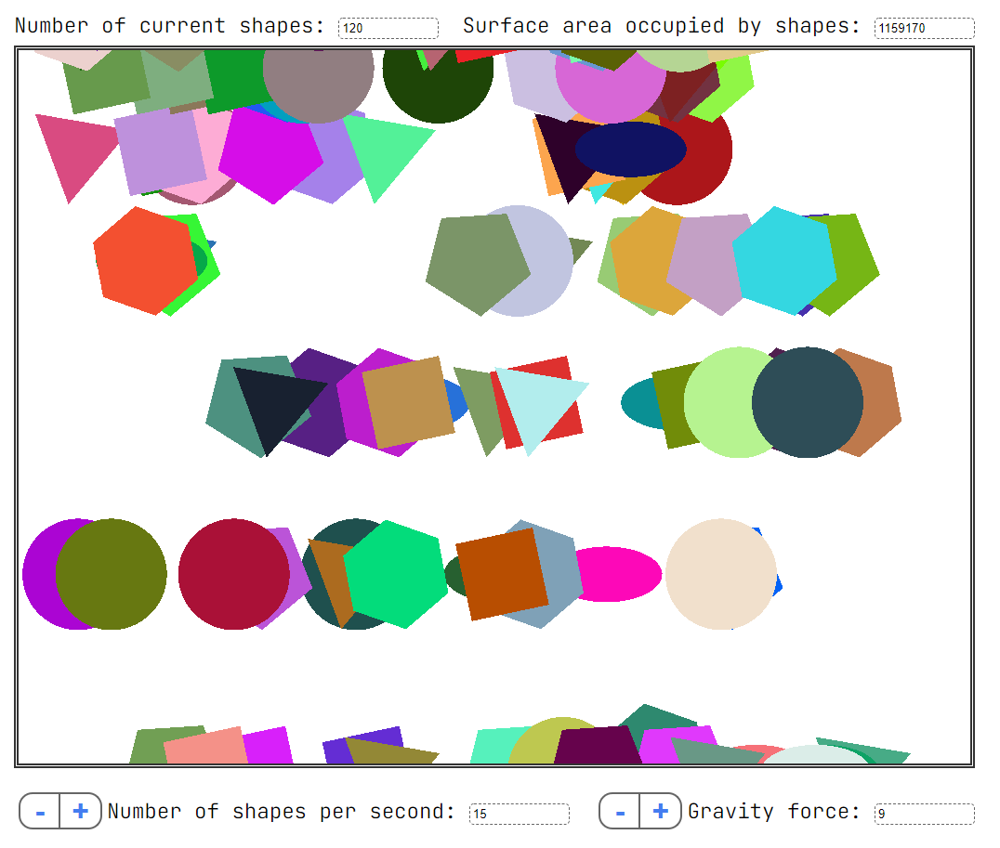

# Falling shapes

Simple 2D game created on Pixi.js using MVC architecture.  
You can play it for your one in [game page](https://bodamat.itch.io/falling-shapes)

Main feature:

- Falling geometry objects
- Remove geometry object by click on them
- Create geometry object by click on free area

Main dependencies:

- **Package manager**: [npm](https://www.npmjs.com/)
- **Compiler**: [TypeScript](https://github.com/Microsoft/TypeScript)
- **Bundler**: [Webpack](https://github.com/webpack/webpack)
- **Pixi.js**: [Pixi.js](http://www.pixijs.com/)

## Installation

**Node with npm** and **TypeScript** should be installed globally.

    $ git clone https://github.com/bodamat/Pixi.js_MVC.git
    $ cd Pixi.js_MVC
    $ npm install

## Build

Recommend use a **bash** shell.

The following command builds and run the project in development mode with Hot Reload.

    $ npm run dev

The following command builds the project in development mode.

    $ npm run build

The following command builds the project in production mode.

    $ npm run prod

## Licence

This content is released under the [MIT](http://opensource.org/licenses/MIT) License.
